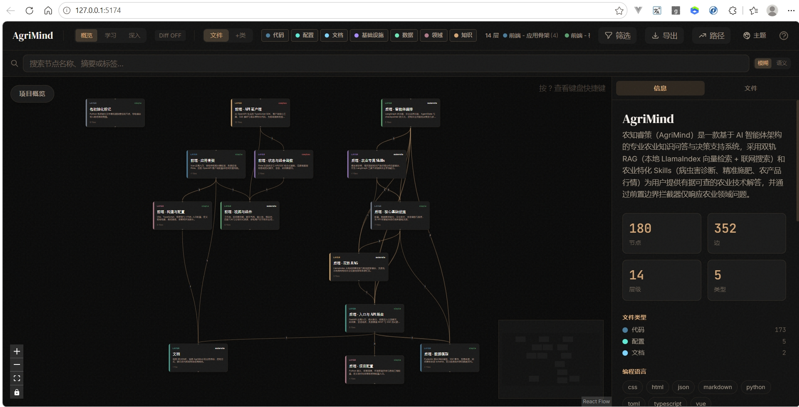
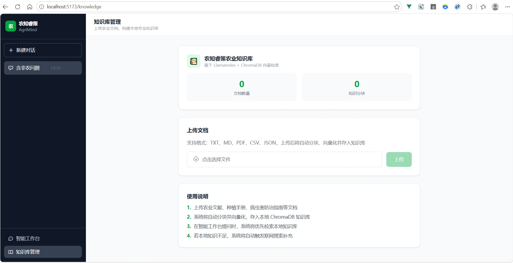
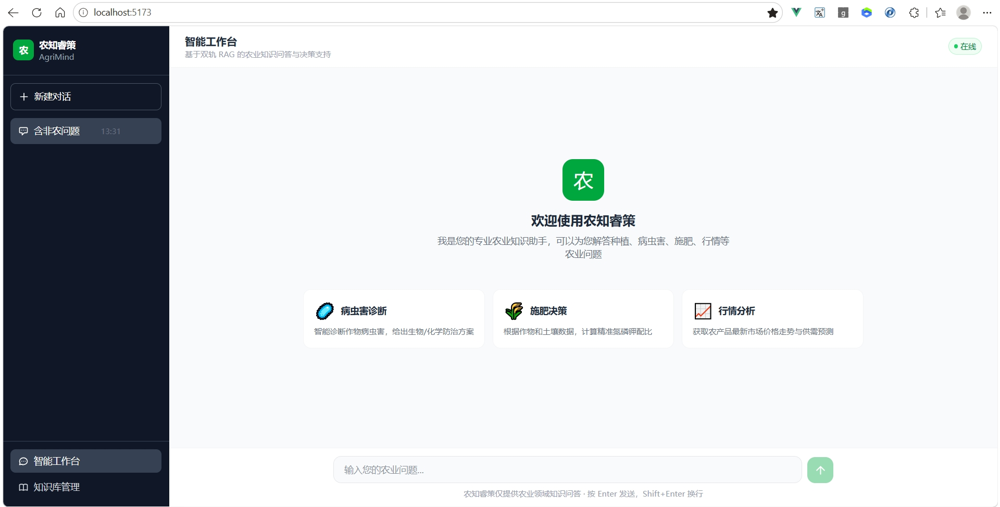
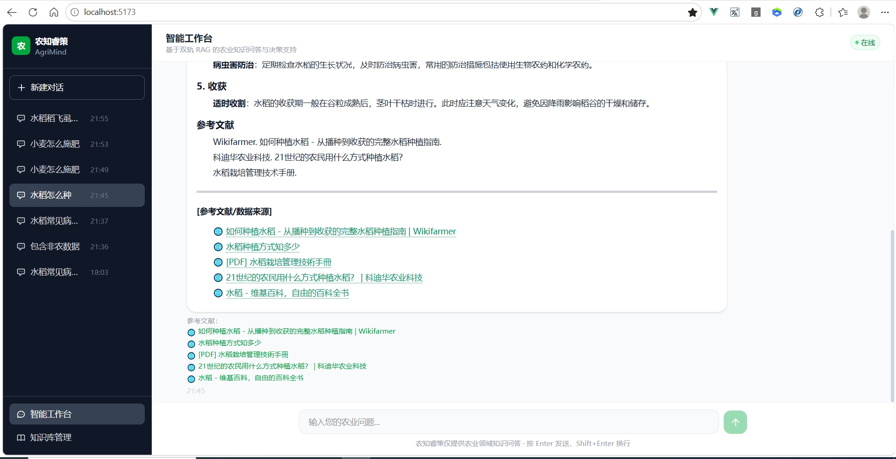

# 农知睿策 (AgriMind / AgriIntellect)

「农知睿策」是一款基于 AI 智能体（Agent）架构的专业农业知识问答与决策支持系统。系统通过双轨 RAG（本地专业知识库检索 + 实时网络搜索）与农业特化 Skills，为用户提供精准、前沿、有据可查的农业技术解答。

**项目核心原则：本系统受安全边界拦截器约束，仅回答农业相关领域的知识，非农业问题将予以拦截。**









---

## 🛠️ 技术栈选型

- **前端 (frontend)**：Vue 3 (Composition API) + TypeScript + Vite + Pinia + Tailwind CSS
- **后端 (backend)**：FastAPI + Python 3.10+
- **智能体大脑**：LangGraph (工作流与状态机控制) + LlamaIndex (本地向量检索与 RAG)
- **数据源**：本地农业文献/手册 + 联网搜索引擎 (Tavily / Serper)

---

## 📂 项目目录结构

```text
AgriMind/
├── claude.md                    # Claude Code 的全局核心行为规范
├── README.md                    # 本说明文档
├── .gitignore                   # Git 忽略配置文件
├── frontend/                     # 前端工程 (Vue3 + TS)
└── backend/                      # 后端工程 (FastAPI + Python)
```
*(详细子目录结构请参见 `claude.md`)*

---

## 🚀 快速开始

### 1. 克隆与配置

克隆项目到本地后，首先配置后端环境变量：

```bash
# 进入后端目录
cd backend

# 复制环境变量模板（请自行创建并填写实际的 API Key）
cp .env.example .env
```

在 `.env` 中填写必要的配置：
```env
OPENAI_API_KEY=your_openai_api_key
OPENAI_BASE_URL=your_openai_base_url
TAVILY_API_KEY=your_tavily_api_key_for_web_search
DATABASE_URL=sqlite:///./app.db
```

---

### 2. 后端启动 (FastAPI)

我们建议使用 Python 虚拟环境进行隔离开发：

```bash
cd backend

# 创建并激活虚拟环境 (以 Linux/Mac 为例)
pyenv virtualenv 3.12.9 agrimindvenv
pyenv activate agrimindvenv
pip install pdm

# Windows 激活命令: .\venv\Scripts\Activate.PS1

# 安装依赖
pdm import requirements.txt
pdm install

# 启动开发服务器
pdm run fastapi dev --port 8080
```
- 后端服务运行于：`http://localhost:8080`
- 交互式 API 文档 (Swagger)：`http://localhost:8080/docs`

---

### 3. 前端启动 (Vue 3)

```bash
cd frontend

# 安装依赖
pnpm install

# 启动本地开发服务
pnpm run dev
```
- 前端服务运行于：`http://localhost:5173`

---

## 🤖 智能体核心架构说明

1. **业务边界拦截 (Agriculture Guardrail)**：用户输入首先经过 LangGraph 的控制节点，利用 LLM/关键词对语义进行归类。非农业问题直接返回固定拒绝语。
2. **双轨检索 (Dual-Track RAG)**：
   - **本地轨**：通过 `LlamaIndex` 检索本地离线的《农业种植手册》、《病虫害防治指南》等核心高置信度文档。
   - **联网轨**：通过 `web_search` 技能，实时获取最新的天气、农产品行情、突发灾情应对。
3. **专业技能 (Specialized Skills)**：
   - `pest_expert`: 病虫害智能诊断
   - `fertilizer_calc`: 精准施肥配方计算
   - `market_analyzer`: 农产品价格走势与供需分析

---

## 📝 开发与贡献规范

- **代码规范**：前端严格禁止使用 `any`，所有组件和数据流必须声明 TS Interface；后端接口必须编写 Pydantic Schema 进行数据强校验。
- **Claude Code 使用**：本项目已配置 `claude.md` 规则文件。在使用 Claude Code 进行自动化编码、微调或测试时，请确保其已通读该文件，严禁生成任何超出农业边界的问答逻辑。
